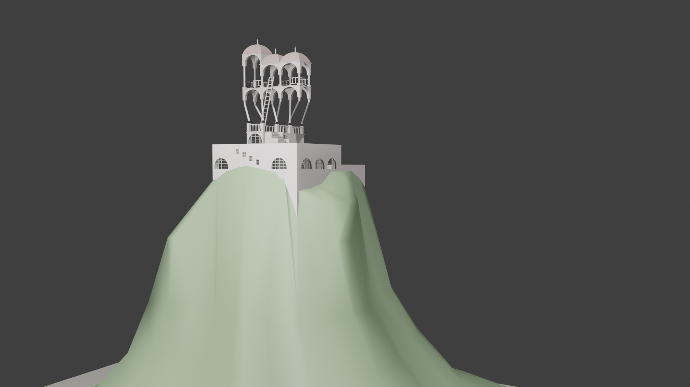

# Belvedere-Escher: Mathematik am 3D-Modell

Blender-Python-Skripte für eine Mathe-Präsentation über M. C. Eschers *Belvedere*: Das unmögliche Gebäude wird als 3D-Modell geladen, mit mathematischen Overlays versehen (Winkel 54° / 74°, Abstand √2, Koordinatenachsen) und in Vergleichsansichten gerendert – Eschers Täuschung neben der geometrisch korrekten Variante.



## Skripte

| Skript | Zweck |
|---|---|
| `import_glb_to_blend.py` | GLB-Modell in eine Blender-Szene importieren |
| `inspect_belvedere_model.py`, `analyze_scene.py`, `summarize_belvedere_math_scene.py` | Szene analysieren, Maße und Objekte auflisten |
| `build_belvedere_math_scene.py` | Mathe-Overlays (Winkel, Abstände, Achsen) an das Modell anbauen |
| `build_belvedere_aligned_math_scene.py`, `adjust_belvedere_math_cameras.py` | Ausgerichtete Variante mit korrigierten Kameras |
| `inspect_camera_projection.py` | Kameraprojektion prüfen |
| `render_belvedere_math_views.py`, `render_belvedere_aligned_views.py` | Alle Ansichten rendern (`renders/`, `renders_aligned/`) |
| `make_visible_scene.py` | Sichtbare Vorschau-Szene erzeugen |

Ausführen in Blender (Scripting-Tab) oder per Kommandozeile:

```bash
blender --background --python build_belvedere_math_scene.py
```

Die Skripte erwarten die `.blend`-Dateien im selben Ordner (`WORK_DIR` am Anfang jedes Skripts anpassen).

## Renders

`renders/` zeigt die Escher-Ansicht mit Overlays, `renders_aligned/` die korrigierte Geometrie am Gebäude: Hero, Koordinaten und Mathe am Gebäude, Vergleich Escher vs. korrekt, Nahaufnahmen der Winkel 54°/74° und des Abstands √2.

## Präsentationsprüfung (Abitur 2026)

Die Blender-Renders waren Teil meiner Präsentationsprüfung im Fach Mathematik. Leitfrage: *Wie lassen sich die optischen Täuschungen in M. C. Eschers „Belvedere" mithilfe analytischer Geometrie und Analysis mathematisch erklären?* Ausgangspunkt ist ein Koordinatenmodell des Gebäudes; daraus werden Ebenen, Säulen, Winkel, Abstände und Längenverhältnisse untersucht und der geometrische Widerspruch der Zeichnung gezeigt. Ergänzend wird die Figur mit Hut und Kleid durch Funktionen modelliert und die Kleidfläche per Integral angenähert.

`praesentation/` enthält:

| Datei | Inhalt |
|---|---|
| `Praesentation_Belvedere_Escher.pptx` | Die Folien der Prüfung |
| `Dokumentation_Praesentationspruefung.pdf` | Schriftliche Dokumentation: Aufgabenstellung, Modell, Rechenwege, Quellen |
| `geogebra/grundflaeche_2x6_3d.ggb` | Grundfläche des Gebäudes im Koordinatensystem |
| `geogebra/ebene_E_saeule_S1.ggb`, `geogebra/obere_ebene_F_saeule_S2*.ggb` | Untere und obere Ebene mit Säulen |
| `geogebra/abstand_und_laengen*.ggb` | Abstände und Längenverhältnisse (√2) |
| `geogebra/folie7_kernwiderspruch_*.ggb` | Der Kernwiderspruch: Originalkoordinaten vs. Gegenmodell |
| `geogebra/analysis_kleid_hut_geogebra.ggb` | Analysis-Teil: Hut und Kleid als Funktionen, Fläche per Integral |

Die `.ggb`-Dateien öffnen sich mit [GeoGebra](https://www.geogebra.org/) (Classic oder 3D-Rechner).

## Credits

Das 3D-Modell basiert auf ["Belvedere Escher TPe"](https://sketchfab.com/3d-models/belvedere-escher-tpe-0d06487f2d564793bcb0e603dc1c59ff) von [francoistheking](https://sketchfab.com/francoistheking), lizenziert unter [CC-BY-4.0](http://creativecommons.org/licenses/by/4.0/). Die Skripte stehen unter MIT-Lizenz.

---

*Hinweis zur Historie: Dieses Projekt wurde am 07.09.2026 auf GitHub importiert. Die Commits davor sind aus den Änderungsdaten der Dateien rekonstruiert (ein Commit pro Arbeitstag) und zeigen, wann an welchen Dateien gearbeitet wurde.*
